1. Buka halaman resmi AWS https://aws.amazon.com/

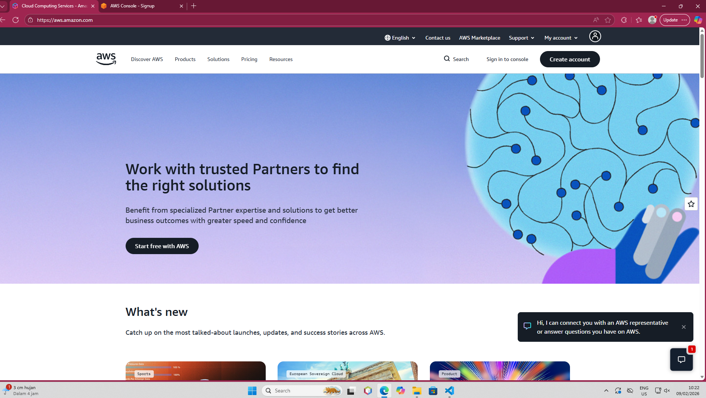

2. Pilih menu creat akun, masukan gmail, dan username akun 
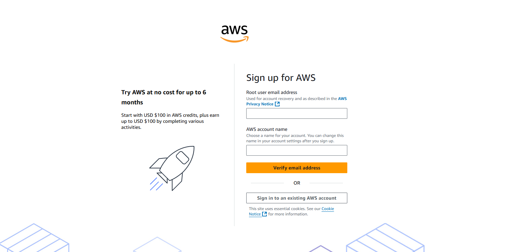

3. verify gmail
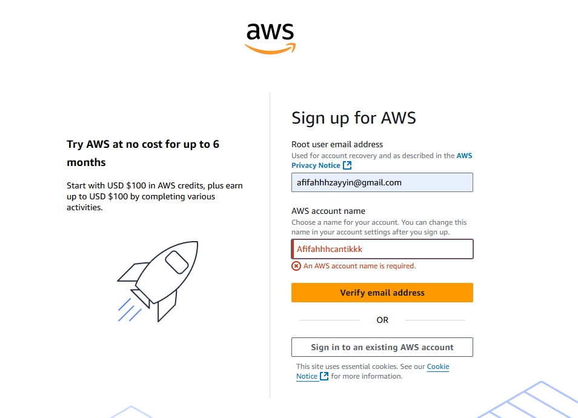

4. maukan kode verify 
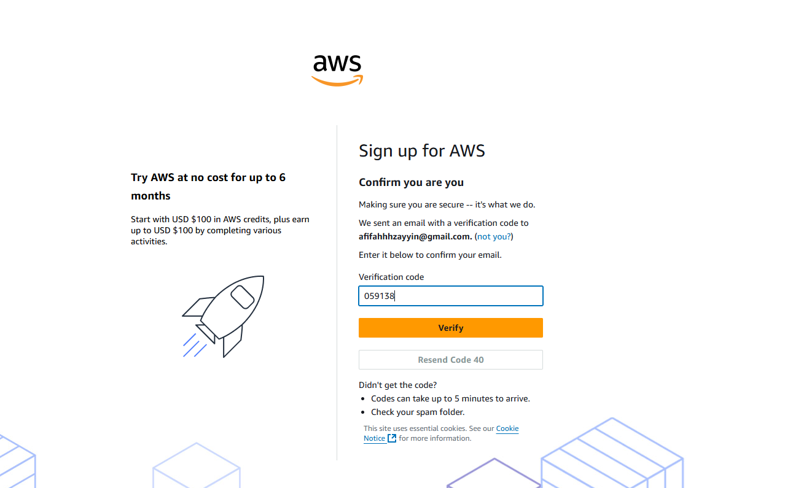

5. membuat password 
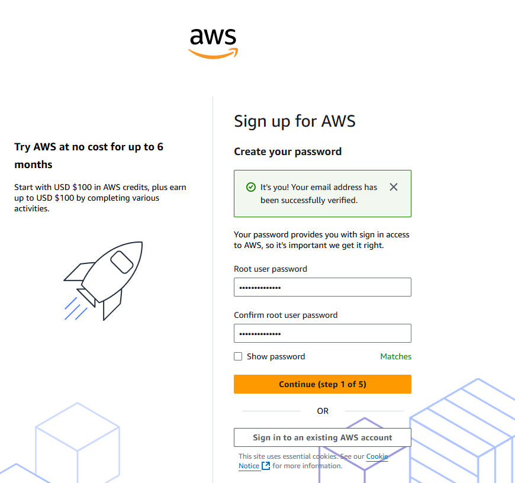

6. pilih free plan
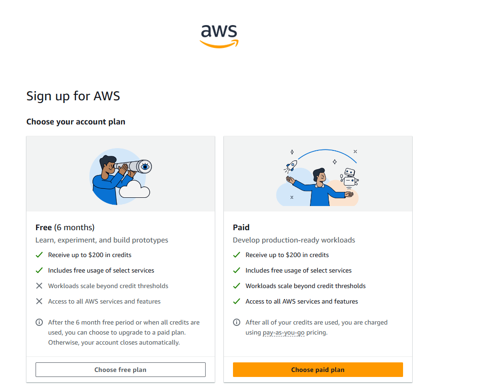

7. masukan informasi identitas
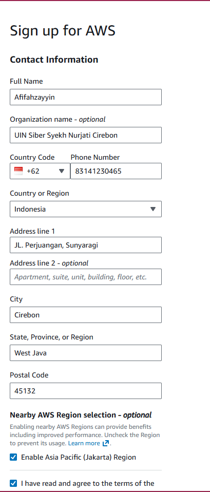

8. biling informasi
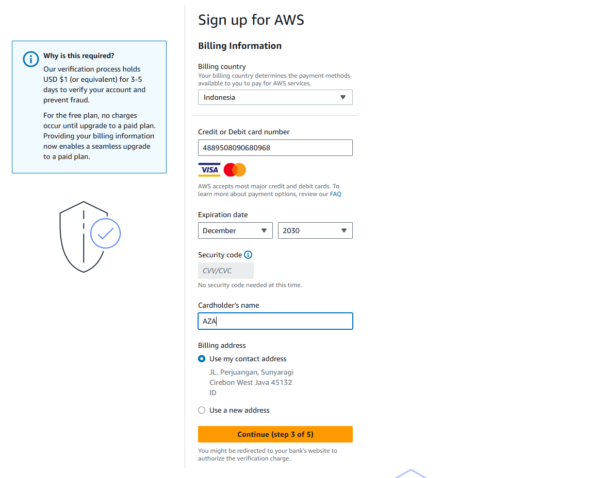

9. 
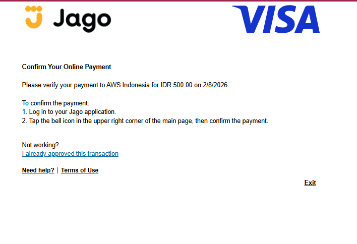

10. CONFIRMASI IDENTITAS
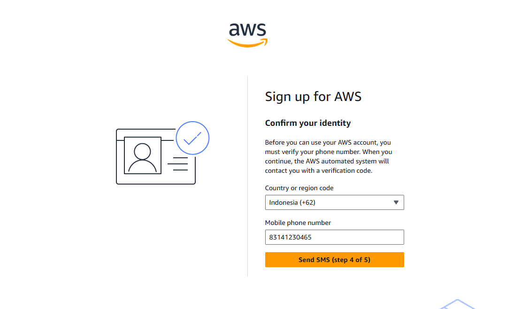

11. Masukan kode verify
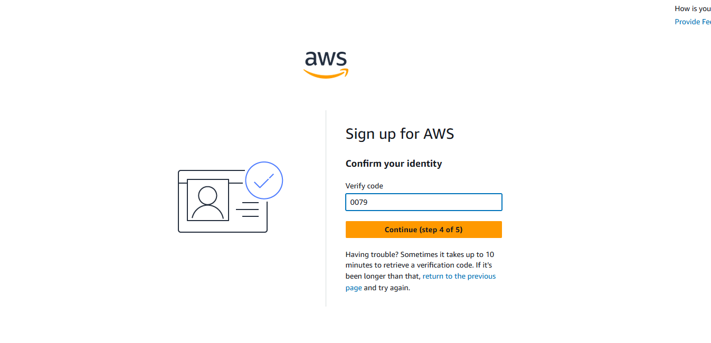

12. 
