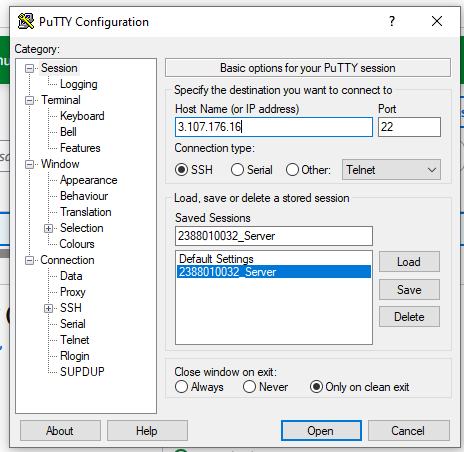
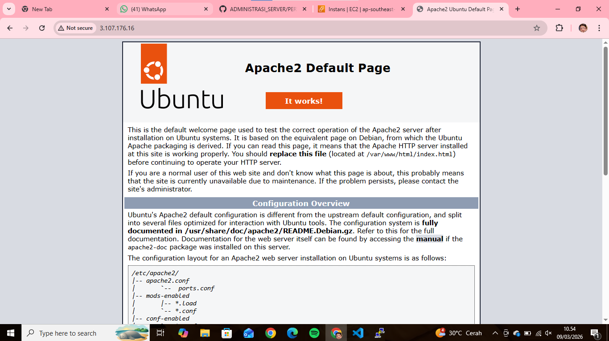
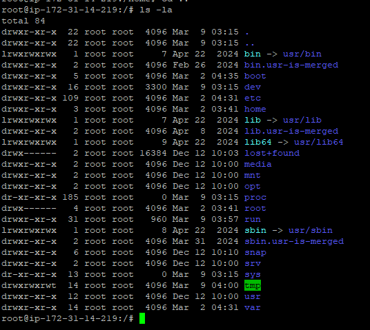
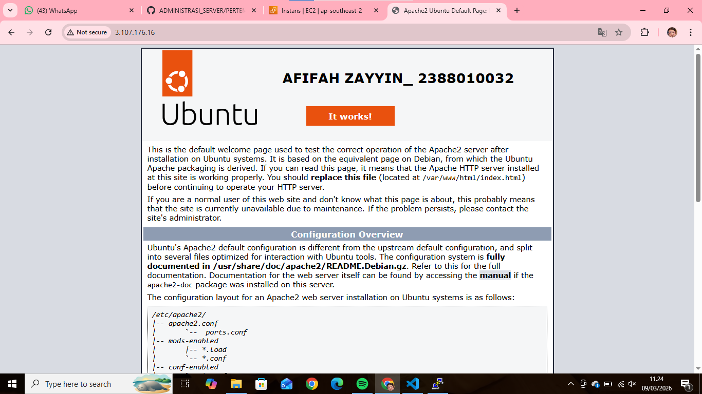

1. Start Instance
2. Buka Putty
3. Kemudian Load save session yang di simpan pada pertemuan 2 (NIM_Server)
4. Update bagian IpAddres

5. sudo apt-get update(untuk Paching OS Linux Server)
6. cek web server kita (systemctl status apache2)
7. sudo systemctl stop apache2 (untuk berhentikan web server)
8. sudo systemctl start apache2 (untuk statr ulang web server)

9. masukan command (ls -la) untuk melihat directory tempat corsor aktif
10. masukan sudo su (untuk masuk ke home)
11. masukan cd .. untuk ke root folder is -la

12. masukan ke folder var(cd var/www/html)
13. masukan nano index.html(untuk custom nama dan nim)

